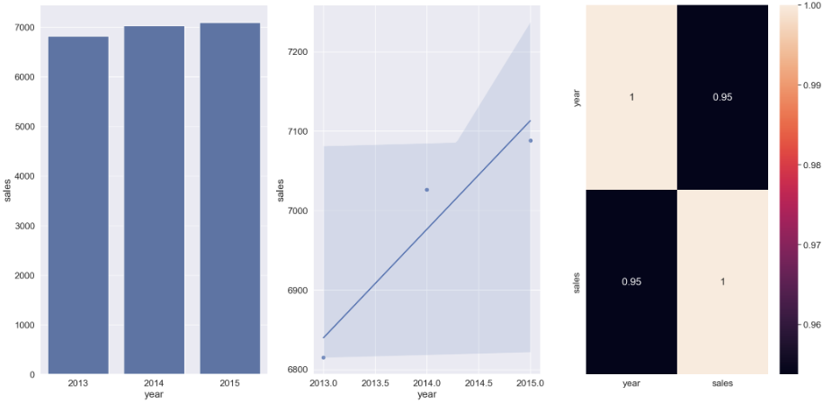
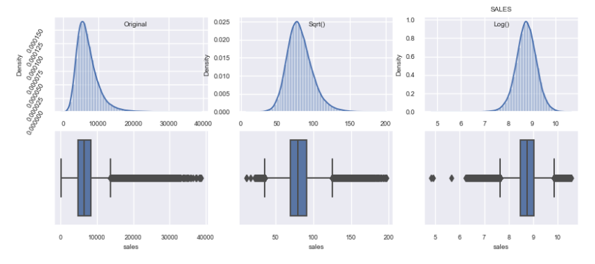
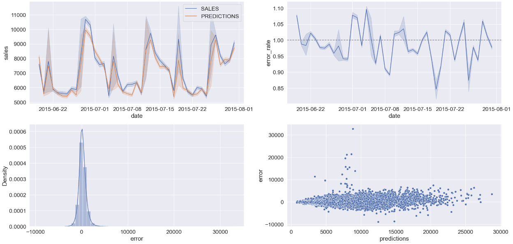
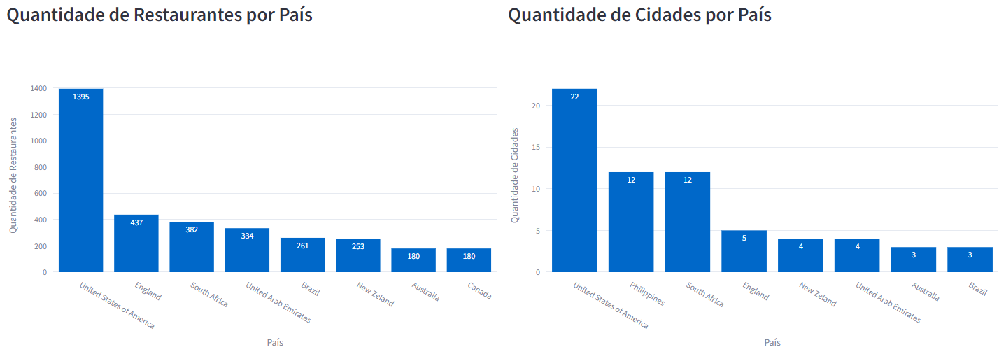
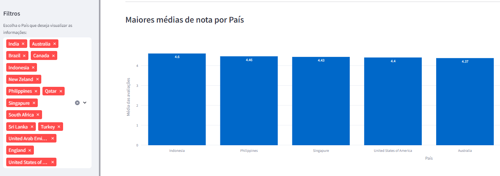
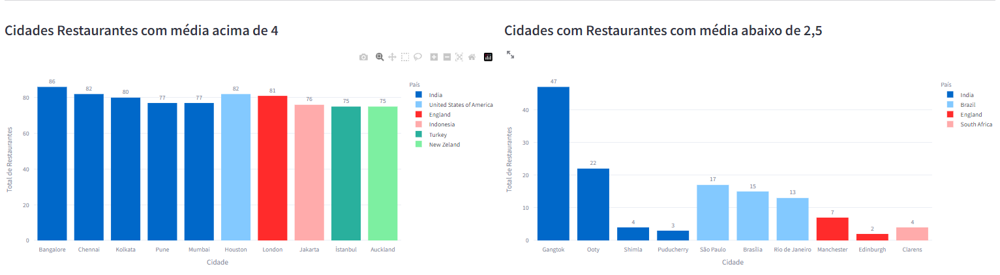
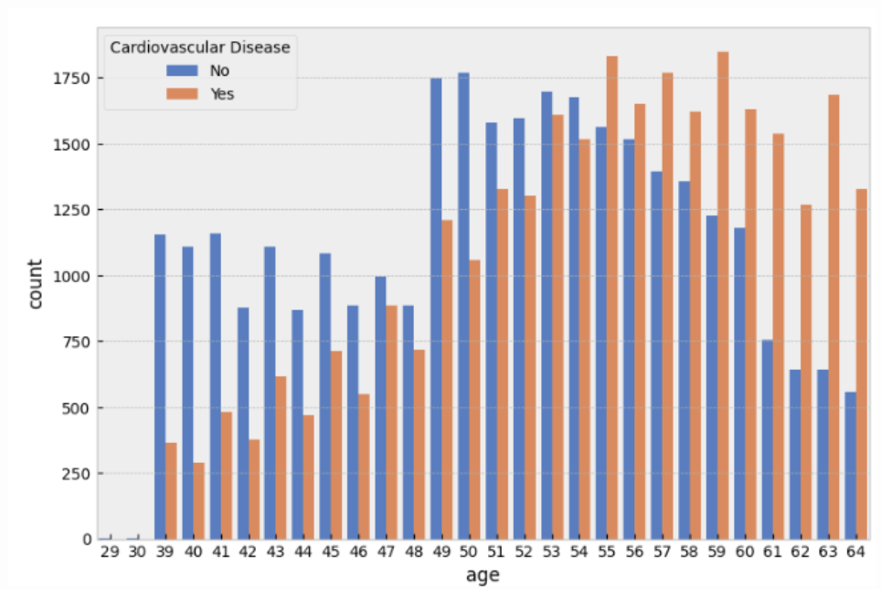
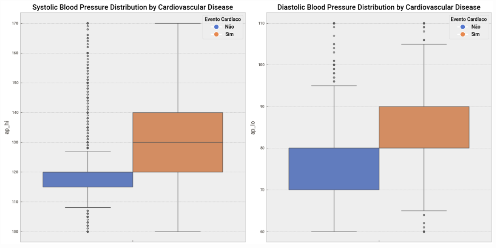
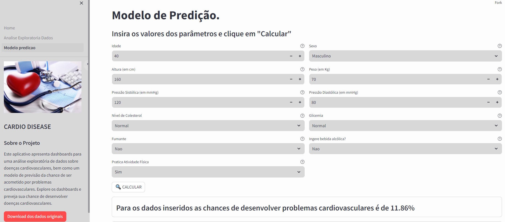

## 🔍 Sobre mim

- Estudo Engenharia de Software na Unifil, Londrina - PR.
- Estudo Ciência de Dados e Análise de dados.
- Atualmente faço estágio no setor de Análise de Dados da Universidade Estadual de Londrina, criando aplicativos na plataforma Qlik para tomada de decisões pelos diversos setores.
- Tenho outra graduação na área de Farmacia-Bioquímica onde atuei por mais de 12 anos.

---

## 🖥️ Tech Skills

- Estudei Java e Python.
- Tenho vários projetos concluídos onde utlizado bibliotecas do Python para análise e criação de modelos de predição (Pandas, Scikit-learn, Jupyter Notebook, Matplotlib)
- Tenho conhecimentos sólidos de SQL e DataWarehouse.
- Power BI e Excel.
- Noções básicas de HTML e CSS.
  

    
    
    
    
    
    
    

---

## 📑Projetos

### 📈 [Previsão de faturamento de uma rede de Farmácias](https://github.com/julianonicoletti/rossmann_prediction_deploy)

Com dados públicos fornecido por uma rede de farmácias da Europa, fiz uma análise exploratória seguido pela construção de um modelo de predição de faturamento para as próximas 12 semanas de cada uma das 1015 filiais. A solução foi entregue e pode ser acessada via Bot do Telegram.

    
    
    
    

[Veja o projeto no GitHub](https://github.com/julianonicoletti/rossmann_prediction_deploy)
___

### 📊 [Dashboard interativo de um serviço de busca de restaurantes usando Streamlit](https://github.com/julianonicoletti/dashboard_zomato)

Com dados públicos fiz uma análise de um serviço de busca de restaurantes presente em vários países. Foi elaborado um dashboard usando o framework Streamlit do Python. Analisamos o resultados dos restaurantes, a distribuição entre os países, e KPIs sobre performance e ranking dos melhores por votação dos clientes.

    
    
    

[Veja o projeto no GitHub](https://github.com/julianonicoletti/dashboard_zomato)

___

### ❤️ [Modelo de previsão de eventos cardiovasculares](https://github.com/julianonicoletti/cardio_predict_model)

Fiz uma análise de um dataset com dados de saúde de 70 mil pacientes com informações como pressão arterial, idade, peso, atividade física, fumante e níveis de glicemia entre outros. Após a análise dos dados foi treinado e testado um modelo que, com base nesses dados fornecidos pelo usuário, ele consegue prever as chances de desenvolver um problema cardíaco. A solução foi hospedada no Streamlit Cloud e disponível para qualquer pessoa utilizar.

    
    
    

[Veja o projeto no GitHub](https://github.com/julianonicoletti/cardio_predict_model)

---

## 🛠 Habilidades

Tenho facilidade em análises para acrescentar informação e ajudar na tomada de decisões. Vou a fundo na análise do negócio para entender as necessidades da equipe e resgatar nos dados o necessário para as decisões. Tenho ótima comunicação e relacionamento interpessoal, sou proativo e sempre estou disposto a dar 100% do meu tempo e empenho em buscar uma melhor solução.

---
##  💾 Interessante

Tive meu primeiro contato com computadores lá pelos anos 90 quando meu pai comprou um 486DX2 para "digitalizar" seu estoque de produtos de uma livraria e papelaria (Livraria Kometa em Cianorte no Paraná). Peguei uma apostila de MS-DOS de um amigo e aprendi praticamente tudo sozinho. Ele comprou um software de controle de estoque e fiquei mais de 45 dias das minhas férias cadastrando os quase 1200 produtos da loja. Sempre gostei da área, montei meu primeiro computador em 2000, um Athlon (K7), mas por escolhas fiz faculdade de Farmácia. Aprendi e exerci muita coisa nesses quase 15 anos. Agora, em 2023 resolvi voltar a minha primeira paixão, já experiente como pessoa, mas ainda iniciante na área de programação..

---
## Contato

<a href="https://www.linkedin.com/in/juliano-nicoletti-06549359/">
    
<a href="https://www.facebook.com/juliano.nicoletti">
    
    <a href="https://medium.com/@julianonicoletti_82306">
    

</a>
